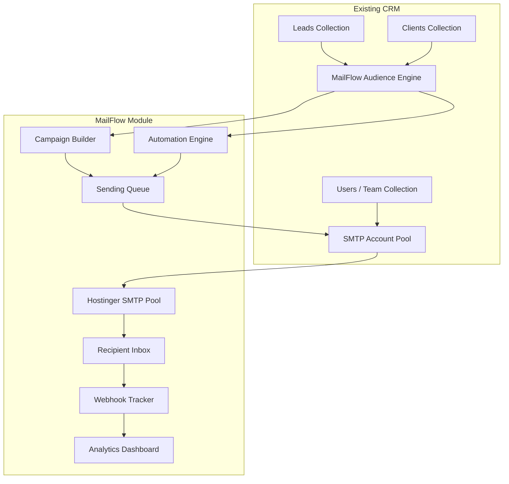

# MailFlow — Email Marketing Module for NetBots CRM

## Comprehensive Technical Design & Feature Specification

> **Module Codename**: MailFlow  
> **Integration Target**: NetBots CRM (`crm.netbots.io`)  
> **Version**: 1.0  
> **Date**: July 2026

---

## Table of Contents

1. [Module Overview](#1-module-overview)
2. [Architecture & Integration with Existing CRM](#2-architecture--integration-with-existing-crm)
3. [Sidebar Restructuring](#3-sidebar-restructuring)
4. [SMTP Account Pool Configuration Module](#4-smtp-account-pool-configuration-module)
5. [Sub-Modules & Pages](#5-sub-modules--pages)
6. [Backend Models (Mongoose Schemas)](#6-backend-models-mongoose-schemas)
7. [Backend API Routes](#7-backend-api-routes)
8. [Complete Use Cases](#8-complete-use-cases)
9. [Frontend Pages — Detailed Specifications](#9-frontend-pages--detailed-specifications)
10. [Phased Roadmap](#10-phased-roadmap)

---

## 1. Module Overview

MailFlow is a **tightly integrated but self-contained email marketing module** within the NetBots CRM. It allows the CRM team to:

- Send bulk email campaigns to leads, clients, or custom contact lists.
- Build visual email templates with a drag-and-drop editor.
- Create automated email sequences (drip campaigns, welcome series, follow-up chains).
- Segment audiences using CRM lead/client data (stage, temperature, channel, industry, tags).
- Track campaign analytics (opens, clicks, bounces, unsubscribes).
- Manage a pool of 50+ Hostinger SMTP accounts (each with 300 emails/day limit) to maximize daily sending capacity.
- All without leaving the CRM dashboard.

### Key Differentiator: CRM-Native Integration

Unlike standalone email tools (Mailchimp, Brevo), MailFlow **directly reads from the CRM's Lead and Client collections**. This means:
- No CSV exports/imports — your audience is always live and synced.
- Segments can use CRM-specific fields (lead stage, temperature, assigned closer, channel source, etc.).
- Campaign performance can be viewed alongside sales pipeline metrics.

---

## 2. Architecture & Integration with Existing CRM

### Current CRM Stack
| Layer | Technology | Key Files |
|-------|-----------|-----------|
| Frontend | React + Vite + Shadcn/UI | `frontend/src/` |
| Backend | Node.js + Express 5 | `backend/server.js`, `backend/routes/` |
| Database | MongoDB (Mongoose ODM) | `backend/models/` |
| Auth | JWT session-based | `backend/routes/auth.js` |

### MailFlow Integration Points



### New Files & Directories

```
backend/
├── models/
│   ├── EmailAccount.js        # [NEW] SMTP account pool model
│   ├── EmailTemplate.js       # [NEW] Reusable email template model
│   ├── EmailCampaign.js       # [NEW] Campaign model (metadata + stats)
│   ├── EmailSequence.js       # [NEW] Automation/drip sequence model
│   ├── EmailLog.js            # [NEW] Per-email delivery log (send/open/click/bounce)
│   ├── EmailList.js           # [NEW] Custom mailing list model
│   └── Unsubscribe.js         # [NEW] Global unsubscribe registry
├── routes/
│   ├── emailAccounts.js       # [NEW] SMTP pool CRUD + health checks
│   ├── emailTemplates.js      # [NEW] Template CRUD
│   ├── emailCampaigns.js      # [NEW] Campaign CRUD + send/schedule
│   ├── emailSequences.js      # [NEW] Automation CRUD + trigger management
│   ├── emailAnalytics.js      # [NEW] Open/click/bounce tracking + dashboards
│   ├── emailLists.js          # [NEW] Custom list management
│   └── emailWebhooks.js       # [NEW] Tracking pixel + link redirect handlers
├── services/
│   ├── emailSender.js         # [NEW] Queue-based sending with SMTP pool rotation
│   ├── emailTracker.js        # [NEW] Open/click tracking pixel & link rewriter
│   └── smtpHealthCheck.js     # [NEW] Periodic SMTP account verification
│
frontend/src/
├── pages/email/
│   ├── EmailDashboard.jsx     # [NEW] MailFlow overview dashboard
│   ├── EmailAccounts.jsx      # [NEW] SMTP pool configuration page
│   ├── EmailTemplates.jsx     # [NEW] Template library + editor
│   ├── EmailCampaigns.jsx     # [NEW] Campaign list + creation wizard
│   ├── CampaignBuilder.jsx    # [NEW] Drag-and-drop campaign composer
│   ├── CampaignReport.jsx     # [NEW] Single campaign analytics view
│   ├── EmailSequences.jsx     # [NEW] Automation/drip sequence list
│   ├── SequenceBuilder.jsx    # [NEW] Visual sequence editor
│   ├── EmailLists.jsx         # [NEW] Custom list management
│   ├── EmailAnalytics.jsx     # [NEW] Global email analytics dashboard
│   └── Unsubscribes.jsx       # [NEW] Unsubscribe management & suppression
```

---

## 3. Sidebar Restructuring

### Current Sidebar (Before MailFlow)

```
├── Dashboard
├── Leads Pipeline
├── Follow-ups
├── Clients
├── Performance Stats
├── Team
├── Permissions
├── Commissions
├── Payouts
├── Leaderboard
├── Audit Logs
├── Packages & Pricing
└── Help & Docs
```

### Proposed Sidebar (After MailFlow)

The sidebar will be restructured into **collapsible grouped sections** to accommodate the new email marketing module without overwhelming the navigation. Each group has a heading label and its child links.

```
📊 WORKSPACE
├── Dashboard
├── Performance Stats
├── Leaderboard

📋 SALES PIPELINE
├── Leads Pipeline
├── Follow-ups
├── Clients

📧 EMAIL MARKETING               ← NEW MODULE
├── Email Dashboard
├── Campaigns
├── Templates
├── Sequences (Automations)
├── Mailing Lists
├── SMTP Accounts
├── Analytics
├── Unsubscribes

👥 ADMINISTRATION
├── Team
├── Permissions
├── Commissions
├── Payouts
├── Audit Logs

📦 RESOURCES
├── Packages & Pricing
└── Help & Docs
```

### Implementation Details

**File**: [Layout.jsx](file:///e:/products/netbots-crm/frontend/src/components/Layout.jsx)

The `menuItems` array (currently flat, line 141–154) will be restructured into a **grouped format**:

```jsx
const menuGroups = [
    {
        label: 'Workspace',
        icon: LayoutDashboard,
        items: [
            { to: '/', icon: LayoutDashboard, label: 'Dashboard', permission: 'view_dashboard' },
            { to: '/performance', icon: BarChart3, label: 'Performance Stats', permission: 'view_dashboard' },
            { to: '/leaderboard', icon: Trophy, label: 'Leaderboard', permission: 'view_leaderboard' },
        ]
    },
    {
        label: 'Sales Pipeline',
        icon: ClipboardList,
        items: [
            { to: '/leads', icon: ClipboardList, label: 'Leads Pipeline', permission: 'can_view_leads' },
            { to: '/followups', icon: Clock, label: 'Follow-ups', permission: 'can_view_leads' },
            { to: '/clients', icon: UserSquare2, label: 'Clients', permission: 'manage_clients' },
        ]
    },
    {
        label: 'Email Marketing',
        icon: Mail,
        items: [
            { to: '/email', icon: Mail, label: 'Email Dashboard', permission: 'view_dashboard' },
            { to: '/email/campaigns', icon: Send, label: 'Campaigns', permission: 'view_dashboard' },
            { to: '/email/templates', icon: FileText, label: 'Templates', permission: 'view_dashboard' },
            { to: '/email/sequences', icon: GitBranch, label: 'Sequences', permission: 'view_dashboard' },
            { to: '/email/lists', icon: Users, label: 'Mailing Lists', permission: 'view_dashboard' },
            { to: '/email/accounts', icon: Server, label: 'SMTP Accounts', permission: 'manage_permissions' },
            { to: '/email/analytics', icon: BarChart3, label: 'Analytics', permission: 'view_dashboard' },
            { to: '/email/unsubscribes', icon: UserX2, label: 'Unsubscribes', permission: 'view_dashboard' },
        ]
    },
    // ... Administration, Resources groups
];
```

Each group renders as a collapsible section with a subtle heading label. When the sidebar is collapsed (desktop), group labels are hidden and only icons show with tooltips.

### New Permissions to Add to User Model

```javascript
// Add to User.permissions schema:
can_view_email_marketing: { type: Boolean, default: false },
can_create_campaigns: { type: Boolean, default: false },
can_manage_smtp_accounts: { type: Boolean, default: false },
can_manage_email_templates: { type: Boolean, default: false },
can_manage_sequences: { type: Boolean, default: false },
```

---

## 4. SMTP Account Pool Configuration Module

### The Problem
You have **50+ Hostinger email accounts**, each with a **300 emails/day sending limit**. To maximize throughput:
- 50 accounts × 300 emails/day = **15,000 emails/day** total capacity.
- The system must intelligently **rotate** across accounts, track daily usage per account, and auto-skip exhausted accounts.

### SMTP Account Model

```javascript
// backend/models/EmailAccount.js
const EmailAccountSchema = new mongoose.Schema({
    // Identity
    name: { type: String, required: true },           // "Marketing Account 1"
    email: { type: String, required: true, unique: true }, // "marketing1@netbots.io"
    
    // SMTP Configuration
    smtpHost: { type: String, default: 'smtp.hostinger.com' },
    smtpPort: { type: Number, default: 465 },
    smtpSecure: { type: Boolean, default: true },
    smtpUser: { type: String, required: true },
    smtpPass: { type: String, required: true },        // Encrypted at rest
    
    // Sending Identity
    fromName: { type: String, default: 'NetBots' },    // "From" display name
    replyTo: { type: String },                         // Reply-to address
    
    // Limits & Usage Tracking
    dailyLimit: { type: Number, default: 300 },
    sentToday: { type: Number, default: 0 },
    lastSentAt: { type: Date },
    lastResetAt: { type: Date, default: Date.now },
    
    // Health & Status
    status: {
        type: String,
        enum: ['active', 'paused', 'error', 'exhausted', 'warming_up'],
        default: 'active'
    },
    lastHealthCheck: { type: Date },
    healthCheckResult: { type: String },              // 'ok' | error message
    consecutiveErrors: { type: Number, default: 0 },
    
    // Warm-up Configuration
    isWarmingUp: { type: Boolean, default: false },
    warmUpDayCount: { type: Number, default: 0 },
    warmUpDailyTarget: { type: Number, default: 20 }, // Start slow, ramp up
    
    // Metadata
    tags: [{ type: String }],                          // e.g., "marketing", "transactional"
    priority: { type: Number, default: 1 },            // Higher = preferred
    addedBy: { type: mongoose.Schema.Types.ObjectId, ref: 'User' }
}, { timestamps: true });
```

### SMTP Pool Rotation Algorithm

```
1. Fetch all accounts where status = 'active' AND sentToday < dailyLimit.
2. Sort by (dailyLimit - sentToday) DESC, then by priority DESC.
3. Pick top account → send email → increment sentToday.
4. If send fails → increment consecutiveErrors.
   - If consecutiveErrors >= 3 → set status = 'error', skip to next account.
5. Daily cron job at midnight → reset sentToday = 0 for all accounts.
6. Hourly cron → run health check (test SMTP auth) on 'error' accounts, restore if fixed.
```

### SMTP Configuration Page (Frontend)

**Route**: `/email/accounts`  
**Page**: `EmailAccounts.jsx`

| Feature | Description |
|---------|-------------|
| **Account List Table** | Shows all configured SMTP accounts with columns: Name, Email, Status (badge), Sent Today / Daily Limit (progress bar), Last Health Check, Priority, Actions |
| **Add Account Form** | Dialog/modal with fields: Account Name, SMTP Host, Port, User, Password (masked), From Name, Reply-To, Daily Limit, Tags |
| **Bulk Import** | CSV upload for adding multiple accounts at once (columns: email, password, fromName, dailyLimit) |
| **Health Check Button** | Per-account and "Check All" button that sends a test SMTP AUTH handshake to verify credentials |
| **Usage Dashboard** | Summary cards: Total Accounts, Active Accounts, Total Daily Capacity, Sent Today (aggregate), Remaining Capacity |
| **Warm-Up Toggle** | Enable warm-up mode for new accounts — gradually increases daily target from 20 → 50 → 100 → 200 → 300 over 2 weeks |
| **Edit / Pause / Delete** | Inline actions for each account row |
| **Pool Statistics** | Chart showing hourly sending distribution and per-account utilization |

---

## 5. Sub-Modules & Pages

### 5.1 Email Dashboard (`/email`)

**Purpose**: Central hub for the entire MailFlow module. At a glance view of email marketing health.

**Components**:
- **Summary Cards**: Total Subscribers, Campaigns Sent (this month), Open Rate (avg), Click Rate (avg), Bounce Rate, Unsubscribe Rate
- **Recent Campaigns Table**: Last 10 campaigns with status, sent count, open rate, click rate
- **SMTP Pool Health**: Mini widget showing active accounts / total accounts, remaining daily capacity
- **Quick Actions**: "New Campaign", "New Template", "New Sequence" buttons
- **Upcoming Scheduled**: List of campaigns/sequences scheduled to send in the next 24h
- **Engagement Trend Chart**: Line graph of opens/clicks over the last 30 days

---

### 5.2 Campaigns (`/email/campaigns`)

**Purpose**: List, create, schedule, and manage bulk email campaigns.

#### Campaign List Page
- **Table Columns**: Campaign Name, Status (Draft/Scheduled/Sending/Sent/Paused), Subject Line, Audience (list/segment name), Sent, Opened, Clicked, Created Date, Actions
- **Status Badges**: Draft (gray), Scheduled (blue), Sending (amber pulse), Sent (green), Paused (orange), Failed (red)
- **Filters**: Status, Date Range, Created By
- **Actions**: Duplicate, Edit (if draft), Archive, View Report, Delete

#### Campaign Creation Wizard (`/email/campaigns/new`)

**Step 1 — Setup**:
- Campaign Name
- Subject Line (with personalization merge tags dropdown: `{{firstName}}`, `{{companyName}}`, `{{email}}`)
- Preview Text
- From Account (select from SMTP pool) OR "Auto-rotate" (system picks)
- Reply-To address

**Step 2 — Audience Selection**:
- **Option A**: Select from CRM data:
  - All Leads (with filters: stage, temperature, priority, channel, industry, assigned closer)
  - All Clients (with filters: active/churned, industry, package)
  - Custom Segment (saved segment rules)
- **Option B**: Select a Mailing List (custom uploaded list)
- **Option C**: Manual email entry (comma-separated)
- Shows live recipient count preview
- Auto-excludes: unsubscribed contacts, bounced emails, suppressed addresses

**Step 3 — Content Editor**:
- **Drag-and-Drop Editor**: Visual block-based editor with components:
  - Header Block (logo + navigation links)
  - Text Block (rich text with merge tags)
  - Image Block (upload or URL)
  - Button Block (CTA with link tracking)
  - Divider Block
  - Social Media Links Block
  - Footer Block (unsubscribe link, company address — auto-included for CAN-SPAM)
  - HTML Block (raw HTML for advanced users)
  - Product Card Block (for e-commerce campaigns)
- **Template Selection**: Start from a pre-built template or blank canvas
- **Mobile Preview Toggle**: Side-by-side desktop/mobile preview
- **Merge Tag Insertion**: Click to insert `{{firstName}}`, `{{companyName}}`, `{{unsubscribeLink}}`, etc.

**Step 4 — Review & Send**:
- Full preview of the email as recipient would see it
- Spam Score Check (basic keyword analysis + header checks)
- **Send Options**:
  - Send Now
  - Schedule for Later (date + time picker with timezone)
  - Send at Optimal Time (batch send spread across the day for better deliverability)
- **A/B Test Option**: Split audience, test 2 subject lines, auto-send winner after X hours
- Confirmation dialog before sending

---

### 5.3 Templates (`/email/templates`)

**Purpose**: Reusable email template library.

**Features**:
- **Template Gallery**: Grid view of saved templates with thumbnail previews
- **Categories/Tags**: Welcome, Newsletter, Promotional, Follow-up, Announcement, Transactional
- **Template Editor**: Same drag-and-drop editor as campaigns, but saves as reusable template
- **Pre-built Starter Templates**: 10–15 professionally designed templates covering common use cases
- **Clone / Edit / Delete**: Actions per template
- **HTML Import/Export**: Import HTML email template, export as HTML file

---

### 5.4 Sequences / Automations (`/email/sequences`)

**Purpose**: Multi-step automated email flows triggered by CRM events or time-based rules.

#### Sequence List Page
- **Table Columns**: Sequence Name, Status (Active/Paused/Draft), Trigger Type, Total Enrolled, Completed, Drop-off Rate, Created Date
- **Filters**: Status, Trigger Type

#### Sequence Builder (`/email/sequences/new`)

**Visual Node-Based Editor** with a vertical flow layout:

**Node Types**:

| Node Type | Icon | Description |
|-----------|------|-------------|
| **Trigger** | ⚡ | Entry point — what starts the sequence |
| **Send Email** | ✉️ | Send a specific email template |
| **Wait / Delay** | ⏳ | Wait X hours/days before next step |
| **Condition** | 🔀 | If/Else branch based on a rule |
| **Action** | ⚙️ | Update CRM field, add tag, notify team |
| **Exit** | 🚪 | Remove contact from sequence |

**Available Triggers**:

| Trigger | Description | CRM Integration |
|---------|-------------|-----------------|
| Lead Created | New lead enters CRM | Reads from `Lead` collection |
| Lead Stage Changed | Lead moves to a specific stage | Listens to Lead model updates |
| Tag Added | A specific tag is applied to a contact | Reads `Lead.tags` or custom tags |
| Form Submitted | Website form submission (contact/demo/training) | Reads `Lead.channel === 'Website'` |
| Manual Enrollment | Admin manually adds contacts | User action |
| Date-Based | On a specific date or anniversary | Scheduled |
| No Activity | Contact hasn't opened/clicked in X days | Checks `EmailLog` data |
| Lead Converted to Client | Lead converts to client in CRM | Reads `Lead.convertedToClient` |

**Available Conditions**:

| Condition | Description |
|-----------|-------------|
| Email Opened | Did recipient open the previous email? |
| Link Clicked | Did recipient click a specific link? |
| Lead Stage Is | Check current CRM lead stage |
| Lead Temperature Is | Check current CRM lead temperature |
| Custom Field Equals | Check any CRM field value |
| Time of Day | Only proceed if within business hours |

**Available Actions**:

| Action | Description |
|--------|-------------|
| Update Lead Stage | Move lead to a different pipeline stage |
| Update Lead Temperature | Change lead temperature |
| Add Tag | Tag the contact for segmentation |
| Notify Team Member | Send internal notification (email or in-app) |
| Create Follow-up | Auto-create a follow-up task in CRM |
| Remove from Sequence | Stop all pending emails in this sequence |

**Example Sequence — Welcome Series**:
```
[Trigger: Lead Created with channel = 'Website']
    ↓
[Send Email: Welcome Email Template]
    ↓
[Wait: 2 Days]
    ↓
[Condition: Did they open the welcome email?]
    ├── YES → [Send Email: Services Overview]
    │            ↓ [Wait: 3 Days]
    │            ↓ [Send Email: Case Studies / Portfolio]
    └── NO  → [Send Email: Re-engagement — "Did you see this?"]
                 ↓ [Wait: 5 Days]
                 ↓ [Condition: Any opens?]
                     ├── YES → [Send Email: Services Overview]
                     └── NO  → [Action: Tag as "Cold Lead"] → [Exit]
```

---

### 5.5 Mailing Lists (`/email/lists`)

**Purpose**: Manage custom email lists that supplement CRM-based audiences.

**Features**:
- **Create List**: Name, description, tags
- **Add Contacts**: Manually add email addresses, or import CSV
- **CRM Sync Option**: Create a "smart list" that auto-populates from a CRM segment rule (e.g., "All leads with temperature=warm and stage=nurture")
- **List Subscribers Table**: Email, Name, Status (subscribed/unsubscribed/bounced), Date Added, Source
- **Export List**: Download as CSV
- **Double Opt-in**: Optional per-list — sends confirmation email before adding to list

---

### 5.6 Analytics (`/email/analytics`)

**Purpose**: Global email performance analytics across all campaigns and sequences.

**Dashboard Components**:

| Widget | Description |
|--------|-------------|
| **Delivery Rate** | % of emails successfully delivered (not bounced) |
| **Open Rate** | % of delivered emails opened (tracked via pixel) |
| **Click Rate** | % of delivered emails where at least one link was clicked |
| **Bounce Rate** | % of sends that bounced (split: hard vs soft) |
| **Unsubscribe Rate** | % of recipients who unsubscribed |
| **Spam Complaint Rate** | % flagged as spam (via feedback loops) |
| **Engagement Over Time** | Line chart: opens/clicks per day over last 30/60/90 days |
| **Top Performing Campaigns** | Ranked table by open rate or click rate |
| **SMTP Account Utilization** | Stacked bar chart showing sends per account per day |
| **Geographic Opens** | (Phase 2) Map visualization of where emails are opened |
| **Device/Client Breakdown** | (Phase 2) Desktop vs Mobile vs Webmail opens |

**Per-Campaign Report** (`/email/campaigns/:id/report`):
- Summary cards: Sent, Delivered, Opened, Clicked, Bounced, Unsubscribed
- Open/Click timeline (hourly for first 72 hours, then daily)
- Click heatmap on email content (which links got the most clicks)
- Recipient activity log: per-contact open/click events with timestamps
- A/B test results (if applicable): winner analysis with statistical significance

---

### 5.7 Unsubscribes (`/email/unsubscribes`)

**Purpose**: Manage the global suppression/unsubscribe list.

**Features**:
- **Unsubscribe Table**: Email, Unsubscribed Date, Source Campaign, Reason (if provided)
- **Manual Add**: Add an email address to the suppression list
- **Import Suppression List**: Upload CSV of emails to suppress
- **Search**: Find if a specific email is suppressed
- **Compliance Info**: Shows total suppressed contacts, auto-enforces exclusion from all sends

---

## 6. Backend Models (Mongoose Schemas)

### 6.1 EmailAccount (detailed above in Section 4)

### 6.2 EmailTemplate

```javascript
const EmailTemplateSchema = new mongoose.Schema({
    name: { type: String, required: true },
    category: {
        type: String,
        enum: ['welcome', 'newsletter', 'promotional', 'follow_up', 'announcement',
               'transactional', 're_engagement', 'custom'],
        default: 'custom'
    },
    subject: { type: String },
    previewText: { type: String },
    htmlContent: { type: String, required: true },
    jsonContent: { type: Object },
    thumbnail: { type: String },
    tags: [{ type: String }],
    isSystem: { type: Boolean, default: false },
    createdBy: { type: mongoose.Schema.Types.ObjectId, ref: 'User' }
}, { timestamps: true });
```

### 6.3 EmailCampaign

```javascript
const EmailCampaignSchema = new mongoose.Schema({
    name: { type: String, required: true },
    subject: { type: String, required: true },
    previewText: { type: String },
    fromAccount: { type: mongoose.Schema.Types.ObjectId, ref: 'EmailAccount' },
    replyTo: { type: String },
    
    // Content
    templateId: { type: mongoose.Schema.Types.ObjectId, ref: 'EmailTemplate' },
    htmlContent: { type: String },
    jsonContent: { type: Object },
    
    // Audience
    audienceType: {
        type: String,
        enum: ['all_leads', 'all_clients', 'segment', 'list', 'manual'],
        required: true
    },
    audienceFilters: { type: Object },
    listId: { type: mongoose.Schema.Types.ObjectId, ref: 'EmailList' },
    manualRecipients: [{ type: String }],
    excludeUnsubscribed: { type: Boolean, default: true },
    
    // Status & Scheduling
    status: {
        type: String,
        enum: ['draft', 'scheduled', 'sending', 'sent', 'paused', 'failed', 'cancelled'],
        default: 'draft'
    },
    scheduledAt: { type: Date },
    sentAt: { type: Date },
    completedAt: { type: Date },
    
    // A/B Testing
    isAbTest: { type: Boolean, default: false },
    abVariants: [{
        subject: String,
        htmlContent: String,
        percentage: Number,
    }],
    abWinnerMetric: { type: String, enum: ['opens', 'clicks'], default: 'opens' },
    abTestDurationHours: { type: Number, default: 4 },
    
    // Stats (denormalized for fast reads)
    stats: {
        totalRecipients: { type: Number, default: 0 },
        sent: { type: Number, default: 0 },
        delivered: { type: Number, default: 0 },
        opened: { type: Number, default: 0 },
        uniqueOpens: { type: Number, default: 0 },
        clicked: { type: Number, default: 0 },
        uniqueClicks: { type: Number, default: 0 },
        bounced: { type: Number, default: 0 },
        hardBounced: { type: Number, default: 0 },
        softBounced: { type: Number, default: 0 },
        unsubscribed: { type: Number, default: 0 },
        complained: { type: Number, default: 0 },
        failed: { type: Number, default: 0 },
    },
    
    createdBy: { type: mongoose.Schema.Types.ObjectId, ref: 'User' }
}, { timestamps: true });
```

### 6.4 EmailSequence

```javascript
const EmailSequenceSchema = new mongoose.Schema({
    name: { type: String, required: true },
    description: { type: String },
    status: {
        type: String,
        enum: ['draft', 'active', 'paused', 'archived'],
        default: 'draft'
    },
    
    // Trigger Configuration
    trigger: {
        type: {
            type: String,
            enum: ['lead_created', 'stage_changed', 'tag_added', 'form_submitted',
                   'manual', 'date_based', 'no_activity', 'lead_converted'],
            required: true
        },
        conditions: { type: Object },
    },
    
    // Workflow Steps (ordered array)
    steps: [{
        stepId: { type: String, required: true },
        type: {
            type: String,
            enum: ['send_email', 'wait', 'condition', 'action', 'exit'],
            required: true
        },
        config: { type: Object },
        nextStepId: { type: String },
        branchTrueStepId: { type: String },
        branchFalseStepId: { type: String },
        position: { x: Number, y: Number },
    }],
    
    // Enrollment Stats
    stats: {
        totalEnrolled: { type: Number, default: 0 },
        currentlyActive: { type: Number, default: 0 },
        completed: { type: Number, default: 0 },
        exited: { type: Number, default: 0 },
    },
    
    createdBy: { type: mongoose.Schema.Types.ObjectId, ref: 'User' }
}, { timestamps: true });
```

### 6.5 EmailLog

```javascript
const EmailLogSchema = new mongoose.Schema({
    // Reference
    campaignId: { type: mongoose.Schema.Types.ObjectId, ref: 'EmailCampaign' },
    sequenceId: { type: mongoose.Schema.Types.ObjectId, ref: 'EmailSequence' },
    sequenceStepId: { type: String },
    
    // Recipient
    recipientEmail: { type: String, required: true, index: true },
    recipientName: { type: String },
    recipientType: { type: String, enum: ['lead', 'client', 'list_contact', 'manual'] },
    recipientId: { type: mongoose.Schema.Types.ObjectId },
    
    // Sender
    accountId: { type: mongoose.Schema.Types.ObjectId, ref: 'EmailAccount' },
    fromEmail: { type: String },
    
    // Status
    status: {
        type: String,
        enum: ['queued', 'sent', 'delivered', 'opened', 'clicked',
               'bounced', 'soft_bounced', 'unsubscribed', 'complained', 'failed'],
        default: 'queued'
    },
    
    // Tracking
    messageId: { type: String },
    openCount: { type: Number, default: 0 },
    firstOpenedAt: { type: Date },
    lastOpenedAt: { type: Date },
    clickCount: { type: Number, default: 0 },
    clickedLinks: [{ url: String, clickedAt: Date }],
    
    // Error Info
    errorMessage: { type: String },
    bounceType: { type: String, enum: ['hard', 'soft', null] },
    
    sentAt: { type: Date },
    deliveredAt: { type: Date },
}, { timestamps: true });

// Indexes for fast analytics queries
EmailLogSchema.index({ campaignId: 1, status: 1 });
EmailLogSchema.index({ recipientEmail: 1 });
EmailLogSchema.index({ sentAt: -1 });
EmailLogSchema.index({ status: 1, createdAt: -1 });
```

### 6.6 EmailList

```javascript
const EmailListSchema = new mongoose.Schema({
    name: { type: String, required: true },
    description: { type: String },
    type: { type: String, enum: ['static', 'smart'], default: 'static' },
    smartFilters: { type: Object },
    
    subscribers: [{
        email: { type: String, required: true },
        name: { type: String },
        status: { type: String, enum: ['subscribed', 'unsubscribed', 'bounced'], default: 'subscribed' },
        source: { type: String },
        subscribedAt: { type: Date, default: Date.now },
        unsubscribedAt: { type: Date },
        leadId: { type: mongoose.Schema.Types.ObjectId, ref: 'Lead' },
        clientId: { type: mongoose.Schema.Types.ObjectId, ref: 'Client' },
    }],
    
    stats: {
        totalSubscribers: { type: Number, default: 0 },
        activeSubscribers: { type: Number, default: 0 },
    },
    
    doubleOptIn: { type: Boolean, default: false },
    createdBy: { type: mongoose.Schema.Types.ObjectId, ref: 'User' }
}, { timestamps: true });
```

### 6.7 Unsubscribe

```javascript
const UnsubscribeSchema = new mongoose.Schema({
    email: { type: String, required: true, unique: true, index: true },
    reason: { type: String },
    sourceCampaignId: { type: mongoose.Schema.Types.ObjectId, ref: 'EmailCampaign' },
    sourceSequenceId: { type: mongoose.Schema.Types.ObjectId, ref: 'EmailSequence' },
    unsubscribedAt: { type: Date, default: Date.now },
    method: { type: String, enum: ['link_click', 'manual', 'admin', 'bounce', 'complaint'], default: 'link_click' }
}, { timestamps: true });
```

---

## 7. Backend API Routes

### 7.1 SMTP Accounts (`/api/email-accounts`)

| Method | Endpoint | Description | Auth |
|--------|----------|-------------|------|
| GET | `/` | List all SMTP accounts with usage stats | Admin |
| POST | `/` | Add new SMTP account | Admin |
| PUT | `/:id` | Update SMTP account settings | Admin |
| DELETE | `/:id` | Remove SMTP account | Admin |
| POST | `/:id/test` | Test SMTP connection/auth | Admin |
| POST | `/test-all` | Health check all accounts | Admin |
| GET | `/pool-stats` | Get aggregate pool statistics | Admin |
| POST | `/bulk-import` | Import multiple accounts via CSV | Admin |
| POST | `/:id/toggle-pause` | Pause/resume an account | Admin |
| POST | `/reset-daily-counts` | Manual reset of daily send counters | Admin |

### 7.2 Email Templates (`/api/email-templates`)

| Method | Endpoint | Description | Auth |
|--------|----------|-------------|------|
| GET | `/` | List all templates (filter by category, search) | Auth |
| GET | `/:id` | Get single template with full content | Auth |
| POST | `/` | Create new template | Auth |
| PUT | `/:id` | Update template | Auth |
| DELETE | `/:id` | Delete template | Auth |
| POST | `/:id/clone` | Duplicate a template | Auth |
| GET | `/starters` | Get pre-built system templates | Auth |

### 7.3 Campaigns (`/api/email-campaigns`)

| Method | Endpoint | Description | Auth |
|--------|----------|-------------|------|
| GET | `/` | List all campaigns (filter, paginate, search) | Auth |
| GET | `/:id` | Get campaign details | Auth |
| POST | `/` | Create new campaign (draft) | Auth |
| PUT | `/:id` | Update campaign (only if draft) | Auth |
| DELETE | `/:id` | Delete campaign (only if draft) | Auth |
| POST | `/:id/send` | Send campaign immediately | Auth |
| POST | `/:id/schedule` | Schedule campaign for future send | Auth |
| POST | `/:id/pause` | Pause sending campaign | Auth |
| POST | `/:id/resume` | Resume paused campaign | Auth |
| POST | `/:id/cancel` | Cancel scheduled/sending campaign | Auth |
| GET | `/:id/report` | Get full campaign analytics report | Auth |
| GET | `/:id/recipients` | Get per-recipient delivery status | Auth |
| POST | `/:id/clone` | Duplicate campaign as draft | Auth |
| POST | `/preview-audience` | Preview recipient count for audience filters | Auth |

### 7.4 Sequences (`/api/email-sequences`)

| Method | Endpoint | Description | Auth |
|--------|----------|-------------|------|
| GET | `/` | List all sequences | Auth |
| GET | `/:id` | Get sequence with steps | Auth |
| POST | `/` | Create new sequence | Auth |
| PUT | `/:id` | Update sequence config and steps | Auth |
| DELETE | `/:id` | Delete sequence (if draft/paused) | Auth |
| POST | `/:id/activate` | Activate/publish sequence | Auth |
| POST | `/:id/pause` | Pause active sequence | Auth |
| POST | `/:id/enroll` | Manually enroll contacts | Auth |
| GET | `/:id/enrollments` | Get enrollment status per contact | Auth |
| GET | `/:id/report` | Get sequence performance report | Auth |

### 7.5 Mailing Lists (`/api/email-lists`)

| Method | Endpoint | Description | Auth |
|--------|----------|-------------|------|
| GET | `/` | List all mailing lists | Auth |
| GET | `/:id` | Get list with subscribers | Auth |
| POST | `/` | Create new list | Auth |
| PUT | `/:id` | Update list settings | Auth |
| DELETE | `/:id` | Delete list | Auth |
| POST | `/:id/subscribers` | Add subscribers to list | Auth |
| DELETE | `/:id/subscribers/:email` | Remove subscriber | Auth |
| POST | `/:id/import` | Import subscribers from CSV | Auth |
| GET | `/:id/export` | Export list as CSV | Auth |
| POST | `/:id/sync-crm` | Sync smart list with CRM data | Auth |

### 7.6 Analytics (`/api/email-analytics`)

| Method | Endpoint | Description | Auth |
|--------|----------|-------------|------|
| GET | `/overview` | Global email stats (opens, clicks, bounces, etc.) | Auth |
| GET | `/trends` | Engagement over time (daily/weekly/monthly) | Auth |
| GET | `/smtp-utilization` | Per-account sending stats | Admin |
| GET | `/top-campaigns` | Best performing campaigns ranked | Auth |
| GET | `/deliverability` | Deliverability health score and trends | Auth |

### 7.7 Tracking Webhooks (`/api/email-webhooks`)

| Method | Endpoint | Description | Auth |
|--------|----------|-------------|------|
| GET | `/open/:trackingId` | Tracking pixel hit (1x1 transparent PNG) — records open | Public |
| GET | `/click/:trackingId/:linkIndex` | Link redirect — records click, redirects to actual URL | Public |
| GET | `/unsubscribe/:trackingId` | Unsubscribe link — shows preference page or unsubscribes | Public |
| POST | `/unsubscribe/:trackingId` | Process unsubscribe form submission | Public |
| POST | `/bounce` | Bounce webhook handler (if using external SMTP service) | Webhook |

---

## 8. Complete Use Cases

### Use Case 1: Welcome Email to New Website Leads
| Field | Value |
|-------|-------|
| **Trigger** | New lead enters CRM with `channel = 'Website'` |
| **Sequence** | Auto-enroll in "Welcome Series" sequence |
| **Step 1** | Immediately send "Welcome to NetBots" email |
| **Step 2** | Wait 2 days |
| **Step 3** | If opened → send "Our Services Overview" |
| **Step 3b** | If NOT opened → send "Did you miss this?" (re-engagement) |
| **Step 4** | Wait 3 days → send "Case Studies & Success Stories" |
| **Step 5** | Action: Update lead temperature to "warm" if any email opened |
| **CRM Integration** | Reads from Lead collection; updates Lead.temperature |

### Use Case 2: Bulk Newsletter Campaign
| Field | Value |
|-------|-------|
| **Trigger** | Admin clicks "New Campaign" |
| **Audience** | All leads with `temperature IN ['warm', 'sql']` AND `stage NOT IN ['rejected', 'onboard']` |
| **Content** | Monthly newsletter template with company updates |
| **Sending** | Auto-rotated across SMTP pool (15,000/day capacity) |
| **Tracking** | Open/click tracking via embedded pixel and link rewriting |
| **Post-Send** | View report with per-recipient open/click data |
| **CRM Integration** | Audience pulled live from Lead collection |

### Use Case 3: Follow-Up Drip for Demo-Booked Leads
| Field | Value |
|-------|-------|
| **Trigger** | Lead.demoBooked changes to `true` |
| **Step 1** | Immediately send "Demo Confirmation" email with date/time |
| **Step 2** | Wait until 1 day before demo → send "Demo Reminder" |
| **Step 3** | Wait until 1 day after demo → send "How was your demo?" |
| **Step 4** | If clicked "Ready to Start" CTA → Action: move lead to `stage: 'close'` |
| **Step 4b** | If no click → Wait 3 days → send "Still considering?" with testimonials |
| **CRM Integration** | Triggered by Lead model change; updates Lead.stage |

### Use Case 4: Re-Engagement Campaign for Cold Leads
| Field | Value |
|-------|-------|
| **Trigger** | Manual campaign targeting cold leads |
| **Audience** | All leads with `temperature = 'cold'` AND `createdAt < 30 days ago` AND NOT unsubscribed |
| **Content** | "We haven't heard from you" template with exclusive offer |
| **A/B Test** | Test 2 subject lines: "We miss you!" vs "Exclusive offer inside" |
| **Post-Send** | Auto-send winning variant to remaining 80% after 4 hours |
| **Follow-Up Action** | If opened → tag lead as "re-engaged"; if no open after 7 days → tag as "sunset" |

### Use Case 5: Client Upsell Sequence
| Field | Value |
|-------|-------|
| **Trigger** | Lead.convertedToClient becomes `true` |
| **Step 1** | Wait 7 days → send "Getting the most from your plan" tips |
| **Step 2** | Wait 14 days → send "Premium features you might be missing" |
| **Step 3** | Wait 30 days → send "Upgrade offer" with discount code |
| **CRM Integration** | Triggered by Lead→Client conversion event |

### Use Case 6: SMTP Account Exhaustion Handling
| Field | Value |
|-------|-------|
| **Scenario** | Campaign with 5,000 recipients, 20 active SMTP accounts |
| **Behavior** | System distributes sends across accounts: ~250 per account |
| **If Account Fails** | Auto-skip, redistribute remaining emails to healthy accounts |
| **If All Accounts Exhausted** | Pause campaign, notify admin, resume next day when limits reset |
| **Daily Cron** | At midnight, reset `sentToday = 0` for all accounts |

### Use Case 7: Unsubscribe Flow
| Field | Value |
|-------|-------|
| **Trigger** | Recipient clicks unsubscribe link in email footer |
| **Step 1** | Redirect to preference page: "Unsubscribe from all" or "Reduce frequency" |
| **Step 2** | If full unsubscribe → add to `Unsubscribe` collection |
| **Step 3** | Auto-exclude from ALL future campaigns and sequences |
| **Step 4** | Show confirmation page: "You've been unsubscribed" |
| **CRM Impact** | Email marked as suppressed; no CRM lead/client data is deleted |

### Use Case 8: Agency Multi-Client Campaign Management
| Field | Value |
|-------|-------|
| **Scenario** | NetBots manages email campaigns for 3 different clients |
| **Setup** | Each client has their own SMTP accounts tagged with client name |
| **Sending** | Campaign for Client A only uses SMTP accounts tagged "client_a" |
| **Reporting** | Generate branded PDF report per client showing campaign performance |
| **Isolation** | Mailing lists, templates, and campaigns are tagged per client for filtering |

### Use Case 9: CRM Lead Data Used for Smart Segmentation
| Field | Value |
|-------|-------|
| **Scenario** | Create a dynamic mailing list that auto-syncs with CRM |
| **Smart List Rule** | `Lead.industry = 'ecommerce'` AND `Lead.temperature IN ['warm', 'sql']` AND `Lead.email EXISTS` |
| **Behavior** | List subscriber count updates automatically as new leads match criteria |
| **Usage** | Select this smart list as campaign audience — always sends to current matches |

### Use Case 10: Scheduled Weekly Newsletter
| Field | Value |
|-------|-------|
| **Setup** | Create campaign with "Schedule" option → Every Monday at 9:00 AM PKT |
| **Audience** | Smart list: "Active Subscribers" (all leads/clients with email, not unsubscribed) |
| **Content** | Reusable newsletter template updated weekly with new content |
| **Sending** | System queues emails Monday morning, distributes across SMTP pool over 2-3 hours |
| **Tracking** | Full open/click tracking with weekly comparison charts |

---

## 9. Frontend Pages — Detailed Specifications

### Page Index

| # | Page Name | Route | Component File |
|---|-----------|-------|----------------|
| 1 | Email Dashboard | `/email` | `EmailDashboard.jsx` |
| 2 | SMTP Accounts | `/email/accounts` | `EmailAccounts.jsx` |
| 3 | Template Library | `/email/templates` | `EmailTemplates.jsx` |
| 4 | Template Editor | `/email/templates/:id/edit` | `TemplateEditor.jsx` |
| 5 | Campaign List | `/email/campaigns` | `EmailCampaigns.jsx` |
| 6 | Campaign Builder | `/email/campaigns/new` | `CampaignBuilder.jsx` |
| 7 | Campaign Report | `/email/campaigns/:id/report` | `CampaignReport.jsx` |
| 8 | Sequence List | `/email/sequences` | `EmailSequences.jsx` |
| 9 | Sequence Builder | `/email/sequences/new` | `SequenceBuilder.jsx` |
| 10 | Mailing Lists | `/email/lists` | `EmailLists.jsx` |
| 11 | Analytics Dashboard | `/email/analytics` | `EmailAnalytics.jsx` |
| 12 | Unsubscribe Manager | `/email/unsubscribes` | `Unsubscribes.jsx` |

### Router Registration (App.jsx additions)

```jsx
// Inside <Route path="/" element={...}>
<Route path="email" element={<EmailDashboard />} />
<Route path="email/accounts" element={<EmailAccounts />} />
<Route path="email/templates" element={<EmailTemplates />} />
<Route path="email/templates/:id/edit" element={<TemplateEditor />} />
<Route path="email/campaigns" element={<EmailCampaigns />} />
<Route path="email/campaigns/new" element={<CampaignBuilder />} />
<Route path="email/campaigns/:id/edit" element={<CampaignBuilder />} />
<Route path="email/campaigns/:id/report" element={<CampaignReport />} />
<Route path="email/sequences" element={<EmailSequences />} />
<Route path="email/sequences/new" element={<SequenceBuilder />} />
<Route path="email/sequences/:id/edit" element={<SequenceBuilder />} />
<Route path="email/lists" element={<EmailLists />} />
<Route path="email/analytics" element={<EmailAnalytics />} />
<Route path="email/unsubscribes" element={<Unsubscribes />} />
```

### Server.js Route Registration

```javascript
// Add to backend/server.js:
app.use('/api/email-accounts',   require('./routes/emailAccounts'));
app.use('/api/email-templates',  require('./routes/emailTemplates'));
app.use('/api/email-campaigns',  require('./routes/emailCampaigns'));
app.use('/api/email-sequences',  require('./routes/emailSequences'));
app.use('/api/email-lists',      require('./routes/emailLists'));
app.use('/api/email-analytics',  require('./routes/emailAnalytics'));
app.use('/api/email-webhooks',   require('./routes/emailWebhooks'));
```

---

## 10. Phased Roadmap

### Phase 1 — Foundation (MVP)

> **Goal**: Basic campaign sending with SMTP pool rotation and CRM audience integration.

| Task | Details |
|------|---------|
| SMTP Account Pool Model + CRUD | `EmailAccount` model, admin configuration page, health checks |
| SMTP Pool Rotation Service | Queue-based sender with round-robin rotation, daily limit tracking, error handling |
| Email Template Model + Editor | Basic template CRUD, pre-built starter templates, simple HTML editor |
| Campaign Model + Send Flow | Create draft → select audience from CRM → send via pool → track delivery |
| Open/Click Tracking | Tracking pixel for opens, link rewriting for clicks, `EmailLog` model |
| Unsubscribe Handling | Unsubscribe link in every email, global suppression list, preference page |
| Email Dashboard | Overview page with summary stats, recent campaigns, pool health |
| Sidebar Restructuring | Grouped sections with Email Marketing module |
| Basic Analytics | Per-campaign report: sent/delivered/opened/clicked/bounced |

### Phase 2 — Automation & Templates

> **Goal**: Visual sequence builder and professional template editor.

| Task | Details |
|------|---------|
| Drag-and-Drop Email Editor | Block-based visual editor with components (text, image, button, etc.) |
| Sequence/Automation Model | `EmailSequence` model with trigger → step → condition → action nodes |
| Visual Sequence Builder | Node-based flow editor with drag-and-drop |
| CRM Event Triggers | Listen to Lead model changes (stage, temperature, conversion) to trigger sequences |
| A/B Testing | Subject line split testing with auto-winner selection |
| Mailing Lists | Custom list management with CSV import and CRM smart sync |
| Scheduled Sending | Cron-based scheduled campaign execution |

### Phase 3 — Scale & Intelligence

> **Goal**: Advanced analytics, deliverability tools, and AI assistance.

| Task | Details |
|------|---------|
| Advanced Analytics Dashboard | Engagement trends, SMTP utilization charts, top campaigns |
| Deliverability Tools | SPF/DKIM setup wizard, bounce classification, reputation monitoring |
| SMTP Warm-Up Scheduler | Gradual daily limit increase for new accounts |
| AI Subject Line Suggestions | Use Claude/GPT API for subject line generation |
| Campaign Cloning & Templates Marketplace | Clone campaigns, share templates across team |
| Export & PDF Reports | Downloadable campaign reports for agency client sharing |

### Phase 4 — Multi-Channel & Advanced

> **Goal**: WhatsApp/SMS integration and predictive features.

| Task | Details |
|------|---------|
| WhatsApp/SMS Nodes | Add WhatsApp and SMS action nodes in sequence builder |
| Predictive Segmentation | AI-based "likely to churn" / "likely to buy" segments |
| Send-Time Optimization | ML-based per-recipient optimal send time |
| Landing Page Builder | Simple drag-and-drop landing page editor with form capture |
| Unified Inbox | Reply handling for email responses (stretch) |

---

> [!IMPORTANT]
> This document serves as the complete technical specification for the MailFlow email marketing module. Before proceeding with implementation, please review the sidebar restructuring proposal, the SMTP pool configuration approach, and the phased roadmap to confirm priorities.
